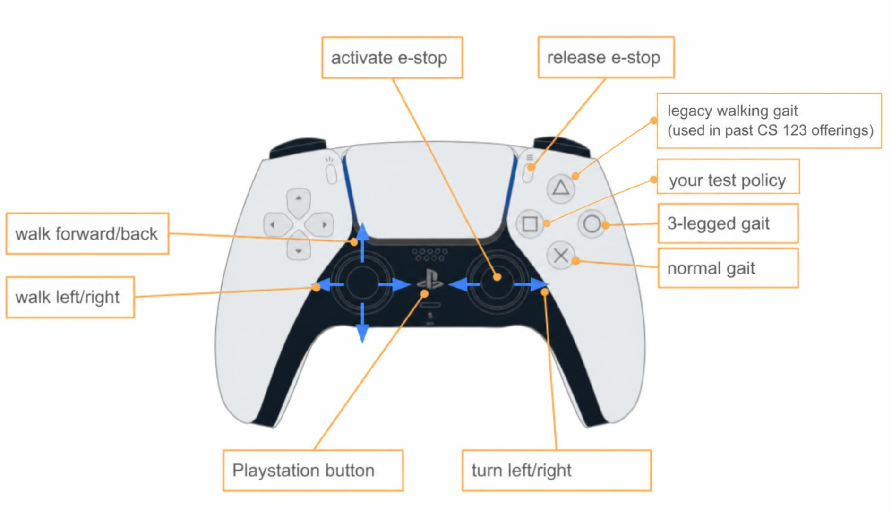

# Pupper policy deploy

Deploys neural-network policies trained in [pupper-mjlab](https://github.com/cs123-stanford/pupper-mjlab)
onto Pupper v3. This repo holds the on-robot controller code, the launch/config
files, and the shipped policies; `install.py` copies them into
`pupperv3-monorepo` and rebuilds, and `deploy.sh` does the whole thing
including launch.

## Deploying your policy

Pupper training runs upload their deploy JSON to the W&B run's **Files**, under
the stable name `policy.json`, when the run ends — both on a normal finish and
when you stop it with Ctrl+C. There is no export step to run by hand: pointing
the robot at your run id is the whole workflow.

```bash
# on the robot
git clone https://github.com/cs123-stanford/pupper_gait_deploy.git ~/pupper_gait_deploy && cd ~/pupper_gait_deploy
./deploy.sh --no-launch        # first time: upgrades wandb if needed (see below)
python3 -m wandb login --relogin   # once, with the same account you train with
./deploy.sh mjlab/<run-id>     # download your policy, install, rebuild, launch
# then press SQUARE on the joystick to activate your policy
```

W&B now issues ~86-character API keys, and wandb older than 0.22.3 rejects any
key that isn't 40 characters — which is what older Pupper images ship. Every
`deploy.sh` run checks the installed version and upgrades it (`pip install
--user`) when it is too old. Log in with `python3 -m wandb login` rather than
the bare `wandb` command, which may still resolve to the old copy on `PATH`.

The run id is the last path component of the W&B run URL. `download_policy.py`
accepts `entity/project/run-id`, `project/run-id`, or a bare `run-id` with
`--project`, and writes `policies/test_policy.json` in this repo — the file the
square button's controller loads.

```bash
./deploy.sh mjlab/abc123xy                   # download + install + rebuild + launch
python3 download_policy.py mjlab/abc123xy    # download and validate only
python3 download_policy.py --validate-only policies/test_policy.json
```

Validation is not cosmetic: a frame-size or joint-order mismatch between the
policy and the controller is silent on the robot until the legs move. The
validator checks the declared observation layout against the controller's
provider menu, the network shapes, the joint order, and any reference tables,
and prints what the controller will do with the file.

## Joystick map



After boot every controller spawns inactive; press a button to bring one in.
E-stop is the right-stick press; the options button releases it and
re-activates the last controller.

| Button | Controller | Policy |
| --- | --- | --- |
| X (cross) | `neural_controller_default` | the default policy shipped in this repo |
| circle | `neural_controller_three_legged` | three-legged gait |
| triangle | `neural_controller` | the original walking policy |
| square | `neural_controller_student` | **your deployed policy** |

The square controller only spawns once a `test_policy.json` has been
installed, so a fresh robot boots clean before your first deploy.

## How the controller reads a policy

The policy JSON is self-describing: the controller reads the network weights,
kp/kd gains, action scale, default pose, joint limits, observation history,
and the observation frame layout (an ordered list of named components —
`obs_spec`) out of the file. It also applies:

- **`command_clip`** — the trained command ranges; the teleop command is
  clamped to them before the policy sees it, exactly as in training.
- **`heading_hold`** — an IMU-yaw P-loop: while walking with a quiet commanded
  yaw, the yaw command becomes a clipped correction toward the heading
  captured when yaw went quiet. Trained runs stamp their own parameters;
  `"kp": 0` disables.
- **`gait_reference`** — for policies that track a phase-clocked reference
  gait, the controller reproduces the reference from tables in the JSON and
  feeds the policy the same 12-dim offset it saw in training.
- **`trick` + `motion`** — trick policies from pupper-mjlab's tracking task
  (`export_trick.py`) carry their reference motion: the controller plays it
  on the wall clock once the policy has faded in (frame 0 before, the last
  frame after), aligned to the robot's heading at activation, and feeds the
  policy the reference joints and body orientation it tracked in training
  (`motion_command`, `motion_anchor_ori_b`, plus `joint_vel_rel`).
- **`trick.clips`** — optional clip table (pupper-mjlab's `concat_clips`).
  The controller plays the first clip, follows each clip's `next`, repeats a
  looping clip, and holds the last frame of a clip with nowhere to go. A clip
  name published on `~/clip` (`std_msgs/String`) plays at the next clip
  boundary; `~/clip_status` reports what is playing. Policies without clips
  play once through, as before.

Two per-controller parameters are off by default, so every controller in
`config.yaml` behaves exactly as before; other launch files (for example the
Gemini Pupper lab's) turn them on for their own controllers:

- **`speed_cap`** — for slot policies, replaces the walk/run speed cap so the
  policy can run without holding a button (0 = keep the policy's caps).
- **`reference_tricks`** — for slot policies, accepts a joint-offset reference
  on `~/reference_trick` (`Float32MultiArray`: `playback_s`, `active_s`,
  `cross_fade_s`, then an n x 12 table) and plays it once through the slot
  overlay. Only references the policy was trained on make sense.

Policies from the original lab pipeline (plain 36-dim frame, no `obs_spec`)
keep loading unchanged — that is what the triangle and circle slots run.

## Repo layout

- `src/neural_controller.{cpp,hpp}` — the ros2_control controller.
- `src/obs_spec.hpp` — resolves the JSON's declared observation layout against
  the controller's provider menu.
- `src/command_filter.hpp` — command clip + heading hold.
- `src/gait_reference*.hpp` — reference-table lookup and JSON parsing.
- `src/trick_motion.hpp` — trick policies' reference motion and the
  relative-orientation observation.
- `config.yaml` / `launch.py` — controller instances, button map, teleop.
- `install.py` — copies everything into the monorepo and rebuilds.
- `download_policy.py` — fetch + validate a policy from a W&B run.
- `policies/` — the shipped policies: `default_policy.json` (X),
  `legacy_walk_policy.json` (triangle), `three_legged_policy.json` (circle);
  your deploy lands here as `test_policy.json`.

## Tests

`test/gait_golden.json` holds reference offsets generated from the trained
mjlab env itself, covering standing, trot, fast forward/backward,
lift-in-place turning, and the time-reversed cases. The C++ has to reproduce
them; `test_command_filter.cpp` covers the command clip, heading hold, and
observation-layout resolution; `test_trick_motion.cpp`
checks the trick observation math against goldens from mjlab's own functions.

```bash
./test/run_host_test.sh      # laptop, no ROS or gtest needed
colcon test --packages-select neural_controller   # on the robot, in the build
```

This is the check that matters most. The failure it guards against — a
truncating `%` instead of a floor-modulo when the phase goes negative, which
is what a backward or turn-in-place command produces — is invisible in a code
review and produces a policy being fed an input it has never seen.

## Notes and gotchas

- **Phase clock.** The controller runs at 520 Hz / `repeat_action` 10 = 52 Hz,
  while the policy trained at 50 Hz. Reference phase is driven off wall-clock
  seconds since the policy took over, not a step count, and kept in `double`:
  a `float` visibly quantizes the phase after a few minutes of uptime.
- **Teleop range.** `scale_linear.x` is 1.5 m/s at full stick. The effective
  cap is min(teleop scale, the policy's `command_clip`), so set the cap at
  export time — the config scale only needs to be at least the widest policy
  you intend to deploy.
- **First run.** `max_body_angle` is 1.5 rad for the student slot (vs 0.52
  for the walking modes) so an early attempt does not trip the fall e-stop
  immediately. Tighten it once your gait is trusted.
- **Per-robot trims.** `kp_scale` in `config.yaml` is 1.0 everywhere. If one
  of your robot's motors is weaker or stiffer than the rest, copy
  `robot_trims.example.yaml` to `robot_trims.yaml` (gitignored) and set the
  scales there; `install.py` writes them into the installed config. The scale
  is relative to the policy's kp — retune if your checkpoint's kp differs.
- **Inference cost.** Watch `~/policy_inference_latency_seconds`; there is
  ~19 ms of budget per policy step.
